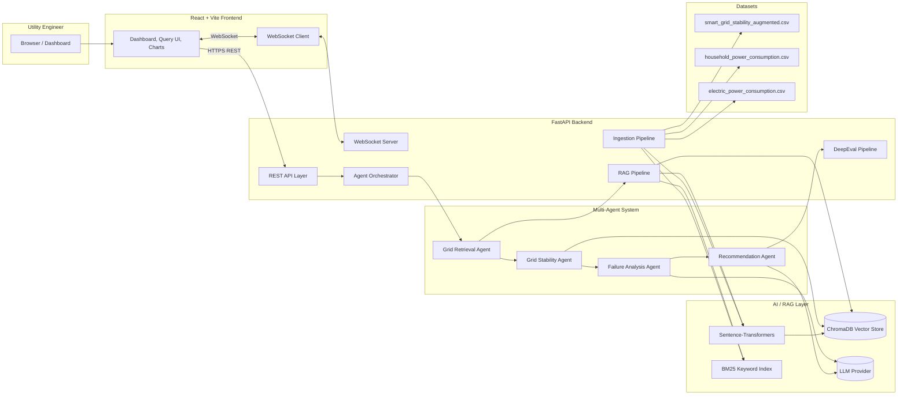
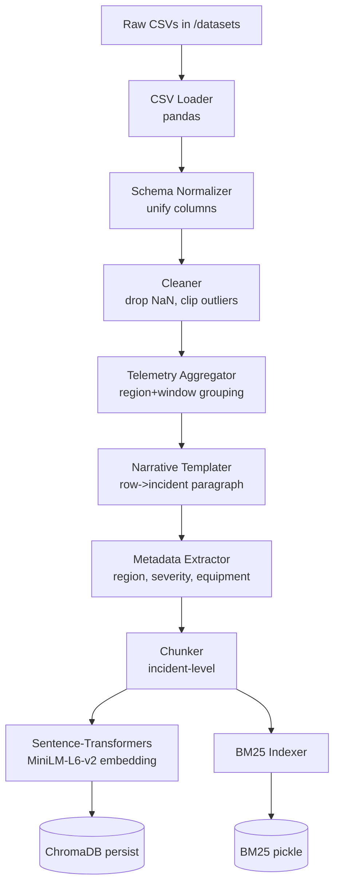
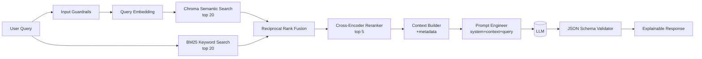
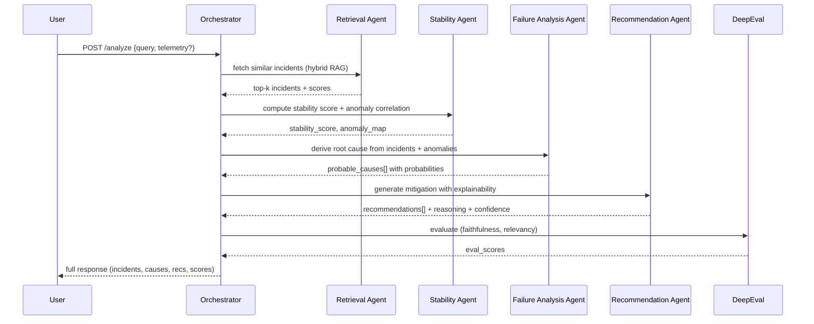
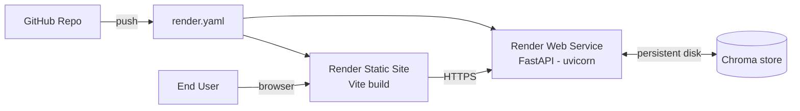

# ARCHITECTURE — AI-Powered Smart Grid Energy Intelligence Assistant

> **Phase:** STEP 1 — Architecture & Project Structure
> **Status:** Design only. No code yet.
> **Owner:** Capstone Project

---

## 1. Executive Summary

The **AI-Powered Smart Grid Energy Intelligence Assistant** is a full-stack, multi-agent, RAG-driven platform that helps utility engineers investigate grid incidents using natural language. It ingests heterogeneous smart-grid telemetry (stability, household, electric power consumption), builds a hybrid (semantic + keyword) retrieval layer over historical incidents, orchestrates four specialized AI agents, and produces **explainable** mitigation recommendations through a modern React dashboard.

The platform is designed as a **microservice** with:

- **Backend:** FastAPI (Python 3.11)
- **AI / RAG:** LangChain + ChromaDB + Sentence-Transformers + Hybrid retrieval
- **Multi-Agent:** Retrieval → Stability → Failure-Analysis → Recommendation
- **Evaluation:** DeepEval + LLM-as-Judge
- **Frontend:** React + Vite + Tailwind + Recharts + Framer Motion
- **Deployment:** Render (backend + static frontend, render.yaml)

---

## 2. Design Goals & Non-Goals

### Goals
1. **Explainable AI** — every recommendation must surface its evidence (telemetry rows + retrieved incidents + agent reasoning).
2. **Hybrid retrieval** — combine BM25 keyword search with semantic embeddings for high recall + precision.
3. **Multi-agent orchestration** — separable, testable agents communicating through a shared context envelope.
4. **Real-time feel** — simulated telemetry stream + WebSocket dashboard updates.
5. **Production-shaped** — modular folders, environment-based config, health checks, render.yaml.
6. **Token-efficient** — chunking + reranking + context compression before LLM calls.

### Non-Goals
- Not a real SCADA replacement; we simulate live telemetry.
- Not a production grid-control system; recommendations are advisory.
- No user management beyond a demo login.

---

## 3. Technology Choices & Trade-offs

| Layer | Choice | Why | Alternatives Rejected |
|---|---|---|---|
| Backend framework | **FastAPI** | Async, auto-OpenAPI, pydantic validation, ideal for AI APIs | Flask (no async/typing), Django (too heavy) |
| Vector DB | **ChromaDB** | Embedded, zero-ops, persistent, metadata filtering | Pinecone (cost + cloud lock-in), FAISS (no metadata) |
| Embeddings | **sentence-transformers (`all-MiniLM-L6-v2`)** | Free, 384-dim, fast on CPU, good semantic quality | OpenAI ada (cost + API dependency) |
| Hybrid search | **BM25 (rank_bm25) + Chroma cosine** | Catches both rare equipment terms and conceptual queries | Pure semantic (misses exact equipment IDs) |
| Orchestration | **LangChain agents + custom orchestrator** | Composability + LCEL chains; custom keeps control | LangGraph (overkill for 4 agents), AutoGen (too opinionated) |
| LLM | **Configurable (OpenAI / Anthropic / local Ollama)** via env | Avoid lock-in, demo runs without paid keys | Hardcoded provider |
| Evaluation | **DeepEval + LLM-as-Judge** | Required by spec; covers faithfulness, relevancy, hallucination | Manual eval only |
| Frontend | **React + Vite + Tailwind** | Fast HMR, utility-first CSS, modern DX | Next.js (SSR not needed), CRA (deprecated) |
| Charts | **Recharts** | Declarative, React-native, good for telemetry lines | D3 (too low-level), Chart.js (imperative) |
| Animation | **Framer Motion** | Glass/glow effects required by UI spec | CSS-only (limits gestures) |
| Realtime | **FastAPI WebSocket + asyncio** | Built-in, no extra broker | Redis pub/sub (infra overhead) |
| Deploy | **Render** | Free tier, render.yaml IaC, native FastAPI + static support | Vercel (no long-running Python), AWS (too complex) |

### Chunking Strategy
- **Telemetry CSV rows** are NOT chunked by characters. They are **semantically aggregated** into **incident narratives** (e.g., grouped by region + timestamp window + equipment_type), then templated into natural-language paragraphs before embedding. This keeps each chunk meaningful and retrievable.
- Each chunk carries metadata: `region`, `severity`, `equipment_type`, `timestamp_window`, `outage_event`, `source_dataset`.

### Hybrid Retrieval Strategy
1. Run BM25 over chunk text → top 20 keyword candidates.
2. Run Chroma semantic search → top 20 semantic candidates.
3. **Reciprocal Rank Fusion (RRF)** merges both lists with weight α=0.6 (semantic) / 0.4 (keyword).
4. Optional cross-encoder reranker (`ms-marco-MiniLM-L-6-v2`) refines top 10 → top 5.

### Anomaly Correlation Strategy
- Z-score per metric (voltage, current, frequency, demand_load) over rolling window.
- Pearson correlation between metrics within an incident window flags coupled anomalies (e.g., voltage drop ↔ frequency dip ↔ transformer overload).
- Output: per-incident `anomaly_score` ∈ [0,1] fused into the grid health gauge.

### Guardrails
- Pydantic input schemas on every endpoint (rejects out-of-range voltage, malformed CSVs).
- LLM output is JSON-schema-validated before being returned to UI.
- "I-don't-know" fallback if retrieved context score is below threshold.
- DeepEval faithfulness check flags hallucinated recommendations.

---

## 4. High-Level System Architecture



---

## 5. Data Flow — Telemetry Ingestion Pipeline



---

## 6. RAG + Hybrid Retrieval Pipeline



---

## 7. Multi-Agent Orchestration



### Agent Contracts (shared envelope)

```jsonc
{
  "query": "string",
  "telemetry": { "voltage": [...], "frequency": [...], ... },
  "retrieved_incidents": [ { "id", "text", "metadata", "score" } ],
  "stability": { "score": 0.0, "anomalies": [...] },
  "root_causes": [ { "cause": "...", "probability": 0.0, "evidence": [...] } ],
  "recommendations": [ { "action": "...", "rationale": "...", "confidence": 0.0 } ],
  "evaluation": { "faithfulness": 0.0, "relevancy": 0.0, "hallucination": false }
}
```

---

## 8. Folder Structure

```
smart-grid-ai-assistant/
│
├── README.md                          # top-level project readme
├── render.yaml                        # Render deployment manifest
├── .gitignore
│
├── datasets/                          # raw input CSVs (gitignored)
│   ├── smart_grid_stability_augmented.csv
│   ├── household_power_consumption.csv
│   └── electric_power_consumption.csv
│
├── requirements/
│   └── requirement.txt                # original capstone requirements
│
├── notes/                             # working notes
│
├── docs/                              # documentation
│   ├── ARCHITECTURE.md                # this file
│   ├── PROJECT_FLOW.md                # file responsibilities + execution
│   ├── PANEL_QA.md                    # panel Q&A prep
│   ├── PRESENTATION_GUIDE.md          # 10-min demo script
│   └── diagrams/                      # exported PNGs (later)
│
├── backend/
│   ├── requirements.txt               # Python deps
│   ├── .env.example                   # env var template
│   ├── Dockerfile                     # optional
│   ├── pytest.ini
│   └── app/
│       ├── main.py                    # FastAPI entrypoint
│       ├── core/
│       │   ├── config.py              # pydantic Settings
│       │   ├── logging.py             # structured logging
│       │   └── lifespan.py            # startup/shutdown hooks
│       ├── api/
│       │   ├── routes_health.py       # GET /health
│       │   ├── routes_analyze.py      # POST /analyze
│       │   ├── routes_ingest.py       # POST /ingest
│       │   ├── routes_incidents.py    # GET /incidents
│       │   ├── routes_telemetry.py    # GET /telemetry
│       │   ├── routes_recommend.py    # GET /recommendations
│       │   ├── routes_score.py        # GET /grid-score
│       │   ├── routes_heatmap.py      # GET /heatmap
│       │   ├── routes_timeline.py     # GET /timeline
│       │   └── routes_ws.py           # WebSocket /ws/telemetry
│       ├── models/
│       │   ├── schemas.py             # pydantic request/response models
│       │   └── enums.py
│       ├── data/
│       │   ├── loader.py              # CSV loading
│       │   ├── cleaner.py             # cleaning + normalization
│       │   ├── aggregator.py          # incident windowing
│       │   ├── templater.py           # row->narrative
│       │   └── ingestion_pipeline.py  # end-to-end ingestion
│       ├── rag/
│       │   ├── embeddings.py          # sentence-transformers wrapper
│       │   ├── vector_store.py        # Chroma client
│       │   ├── bm25_index.py          # keyword index
│       │   ├── hybrid_retriever.py    # RRF fusion + rerank
│       │   ├── reranker.py            # cross-encoder
│       │   ├── prompt_templates.py    # system + user prompts
│       │   └── rag_pipeline.py        # full RAG chain
│       ├── agents/
│       │   ├── base_agent.py          # ABC + envelope
│       │   ├── retrieval_agent.py
│       │   ├── stability_agent.py
│       │   ├── failure_agent.py
│       │   ├── recommendation_agent.py
│       │   └── orchestrator.py        # sequential A2A
│       ├── services/
│       │   ├── anomaly_service.py     # z-score, correlation
│       │   ├── stability_service.py   # grid health scoring
│       │   ├── predictive_service.py  # transformer overload prediction
│       │   ├── smartmeter_service.py  # household anomalies
│       │   ├── heatmap_service.py     # region aggregation
│       │   ├── timeline_service.py    # incident timeline
│       │   └── stream_service.py      # simulated live telemetry
│       ├── evaluation/
│       │   ├── deepeval_runner.py     # DeepEval pipeline
│       │   ├── llm_judge.py           # LLM-as-judge
│       │   └── metrics.py             # custom metrics
│       └── utils/
│           ├── guardrails.py          # input/output validation
│           ├── tokenizer.py           # token counting
│           └── helpers.py
│
└── frontend/
    ├── package.json
    ├── vite.config.js
    ├── tailwind.config.js
    ├── postcss.config.js
    ├── index.html
    ├── .env.example
    ├── public/
    │   └── logo.svg
    └── src/
        ├── main.jsx                   # entry
        ├── App.jsx                    # router
        ├── styles/
        │   └── index.css              # tailwind + custom glass/glow
        ├── assets/                    # images, icons
        ├── hooks/
        │   ├── useApi.js              # fetch wrapper
        │   ├── useWebSocket.js
        │   └── useTheme.js
        ├── services/
        │   └── api.js                 # axios client + endpoints
        ├── components/
        │   ├── layout/
        │   │   ├── Sidebar.jsx
        │   │   ├── Topbar.jsx
        │   │   └── ThemeProvider.jsx
        │   ├── cards/
        │   │   ├── GlassCard.jsx
        │   │   ├── MetricCard.jsx
        │   │   └── AlertCard.jsx
        │   ├── charts/
        │   │   ├── TelemetryLineChart.jsx
        │   │   ├── HealthGauge.jsx
        │   │   ├── Heatmap.jsx
        │   │   └── TimelineChart.jsx
        │   └── agents/
        │       ├── AgentFlow.jsx      # multi-agent visualization
        │       └── ExplainPanel.jsx
        └── pages/
            ├── Dashboard.jsx          # bluish-green (landing page; no login)
            ├── QueryConsole.jsx
            ├── GridStability.jsx      # electric blue
            ├── FailureAnalysis.jsx    # orange/red
            ├── SmartMeter.jsx         # lavender
            ├── Telemetry.jsx          # cyan
            ├── Recommendations.jsx    # green
            ├── AgentVisualization.jsx
            ├── IncidentTimeline.jsx
            ├── HeatmapAnalytics.jsx
            └── Settings.jsx
```

---

## 9. Execution Flow

### 9.1 Backend Boot Sequence
1. `uvicorn app.main:app --reload` is invoked.
2. `main.py` creates the FastAPI app, registers middleware (CORS, request-id, logging).
3. `core/lifespan.py` runs startup:
   - load `core/config.py` settings from `.env`
   - initialize Chroma client (persistent dir `./chroma_store/`)
   - load BM25 pickle if present
   - lazy-init embedding + reranker models
4. Routers from `api/*` are included with prefixes.
5. `GET /health` returns `{status: "ok", components: {...}}`.

### 9.2 First-Time Ingestion
1. User (or startup script) hits `POST /ingest` with optional `dataset` filter.
2. `data/ingestion_pipeline.py` orchestrates: loader → cleaner → aggregator → templater → embeddings → Chroma upsert + BM25 rebuild.
3. Progress reported via logs; final summary returned: `{chunks_added, regions, equipment_types}`.

### 9.3 Analyze Request (the main path)
1. Frontend `QueryConsole.jsx` sends `POST /analyze { query, telemetry? }`.
2. `api/routes_analyze.py` validates with pydantic, calls `agents/orchestrator.py`.
3. Orchestrator runs Retrieval → Stability → Failure → Recommendation agents, sharing the envelope.
4. `evaluation/deepeval_runner.py` scores faithfulness + relevancy.
5. Response returned to frontend; UI renders incidents, causes, recommendations, agent flow, evaluation scores.

### 9.4 Live Telemetry
1. Frontend opens `ws://.../ws/telemetry`.
2. `services/stream_service.py` replays a CSV at simulated 1Hz, broadcasts JSON ticks.
3. Dashboard charts update in real time; gauge recomputes via `/grid-score` poll.

### 9.5 Frontend Boot
1. `npm run dev` → Vite serves `index.html` → mounts `main.jsx` → `App.jsx`.
2. Router exposes pages, Sidebar navigates.
3. Each page calls `services/api.js`; loading + error states animated via Framer Motion.

---

## 10. Important File Responsibilities (Quick Reference)

| File | Responsibility |
|---|---|
| `backend/app/main.py` | FastAPI app factory, middleware, router include, **THIS is what uvicorn runs** |
| `backend/app/core/config.py` | All env vars in one typed Settings object |
| `backend/app/core/lifespan.py` | Startup/shutdown hooks (Chroma init, model warm-up) |
| `backend/app/data/ingestion_pipeline.py` | One-shot entrypoint to ingest all CSVs |
| `backend/app/rag/hybrid_retriever.py` | Heart of retrieval — BM25 + semantic + RRF + rerank |
| `backend/app/agents/orchestrator.py` | Sequential A2A pipeline; the agent system's "main()" |
| `backend/app/services/stability_service.py` | Computes the headline Grid Health Score |
| `backend/app/evaluation/deepeval_runner.py` | DeepEval + LLM-as-judge for output QA |
| `backend/app/api/routes_analyze.py` | `POST /analyze` — the primary user-facing endpoint |
| `frontend/src/App.jsx` | Router; **THIS is what Vite loads first** |
| `frontend/src/services/api.js` | Single source of truth for backend endpoints |
| `frontend/src/pages/Dashboard.jsx` | Landing page with all hero widgets |
| `frontend/src/components/agents/AgentFlow.jsx` | Visual A2A graph — key demo asset |
| `render.yaml` | Render IaC: backend service + frontend static site |

---

## 10b. Scope Decision — No Login Page

The objective treats utility engineers as a homogeneous authorized user class
("enables utility engineers to investigate..."). It does NOT mandate per-user
authentication. Adding a real login flow would require user storage, password
hashing, token management, and RBAC — none of which the capstone panel tests.

**Decision (2026-05-29):** drop the login page. Replace with:

- A non-blocking **Operator** identifier field in the sidebar
  (e.g. "Hani — Operations"). Tagged on every API request as
  `X-Operator-Name` for audit purposes.
- An **audit-log middleware** that records
  `(timestamp, operator, endpoint, query)` to a JSONL file.
- All engineers share the same dashboard; they navigate by **region** and
  **issue type**, not by user identity.

The chunk metadata still carries an optional `tenant_id` slot, so adding JWT
+ multi-tenancy later is a one-day job without re-ingesting data.

## 10c. Dashboard Interactions

| Click / action | Backend call(s) | Visual result |
|---|---|---|
| **"Refresh Data"** button | `POST /api/v1/ingest` → `POST /api/v1/embed` | toast + updated counts |
| **"Run Full Analysis"** button | `GET /grid-score`, `/heatmap`, `/timeline`, `/recommendations` | dashboard widgets refresh |
| **Click region on heatmap** | `GET /incidents?region=South+Zone` | incident list + charts filter |
| **Top Critical Issues** card | `GET /incidents?severity=critical&sort=score` | sorted bar chart |
| **Type query → Send** | `POST /api/v1/guardrails/validate-query` → `POST /api/v1/analyze` | chat bubble + evidence cards |

---

## 11. API Surface (Designed, Not Implemented Yet)

| Method | Path | Purpose |
|---|---|---|
| GET | `/health` | Liveness + component status |
| POST | `/ingest` | Run ingestion pipeline |
| POST | `/analyze` | Main multi-agent query |
| GET | `/incidents` | List/search historical incidents |
| GET | `/telemetry` | Recent telemetry snapshot |
| GET | `/recommendations` | Latest generated recommendations |
| GET | `/grid-score` | Current grid health score |
| GET | `/heatmap` | Region-wise instability heatmap data |
| GET | `/timeline` | Incident timeline data |
| WS  | `/ws/telemetry` | Live simulated telemetry stream |

---

## 12. UI Color System (referenced from spec)

| Page | Accent | CSS variable |
|---|---|---|
| Dashboard | Bluish green | `--accent-dashboard: #5EE6C8` |
| Grid Stability | Electric blue | `--accent-stability: #4DA8FF` |
| Failure Analysis | Orange/Red | `--accent-failure: #FF7A45` |
| Smart Meter | Lavender | `--accent-meter: #B79CFF` |
| Recommendations | Green | `--accent-recommend: #6FE38A` |
| Telemetry | Cyan | `--accent-telemetry: #4DE2F0` |

Base palette: `#F7FBFA` (light bluish-green bg), `#EDE7FE` (lavender wash), `#FFFFFF` (glass surface), `#FFA552` (orange accent), `#1A2238` (deep ink text).

Effects: glassmorphism (`backdrop-blur-md` + 20% white + 1px border), soft elevation shadows, gradient glow on active KPIs, Framer Motion fade/slide-up on mount.

---

## 13. Deployment Topology (Render)



- **Backend:** Render Web Service, Python 3.11, build = `pip install -r backend/requirements.txt`, start = `uvicorn app.main:app --host 0.0.0.0 --port $PORT`, persistent disk mounted at `/var/data/chroma`.
- **Frontend:** Render Static Site, build = `npm ci && npm run build`, publish = `frontend/dist`, env `VITE_API_URL` points at backend service URL.

---

## 14. What Comes Next (Roadmap)

| Step | Deliverable |
|---|---|
| **STEP 1 (this doc)** | Architecture, structure, diagrams, file map |
| STEP 2 | Backend foundation: FastAPI app + health endpoint + config + logging |
| STEP 3 | Data ingestion pipeline (loader → cleaner → aggregator → templater) |
| STEP 4 | Embeddings + ChromaDB |
| STEP 5 | Hybrid search (BM25 + semantic + RRF) |
| STEP 6 | RAG pipeline (prompts + LLM + JSON guardrails) |
| STEP 7 | Multi-agent system + orchestrator |
| STEP 8 | Telemetry analytics + grid health score |
| STEP 9 | Frontend foundation (Vite + Tailwind + routing) |
| STEP 10 | Premium UI (glassmorphism, animations, theme) |
| STEP 11 | Dashboard visuals (charts, gauges, heatmaps) |
| STEP 12 | Frontend ↔ backend integration |
| STEP 13 | Real-time WebSocket telemetry |
| STEP 14 | DeepEval + LLM-judge |
| STEP 15 | Render deployment artifacts |
| STEP 16 | Full documentation set (README, FLOW, QA, PRESENTATION) |

---

**End of STEP 1.** No code has been written yet. Proceed to STEP 2 only after this design is approved.
